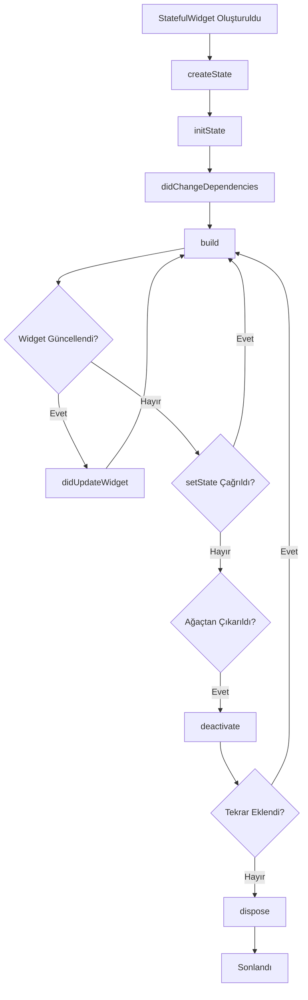

# Flutter StatefulWidget Yaşam Döngüsü (Lifecycle)

Flutter resmi dokümantasyonlarına dayanan detaylı StatefulWidget yaşam döngüsü açıklamaları.

---

## 🔄 Yaşam Döngüsü Sıralaması

```
┌─────────────────────────────────────────────────────────┐
│ 1. createState()           → Framework çağırır          │
│ 2. initState()             → İlk başlatma               │
│ 3. didChangeDependencies() → Bağımlılık kontrolü        │
│ 4. build()                 → UI oluşturma               │
│ 5. didUpdateWidget()       → Widget güncellendiğinde    │
│ 6. setState()              → State değiştiğinde         │
│ 7. deactivate()            → Geçici kaldırma            │
│ 8. dispose()               → Kalıcı temizlik            │
└─────────────────────────────────────────────────────────┘
```

---

## 📚 Metot Detayları

### 🟢 initState()

**Ne Zaman Çağrılır:** Widget ağacına ilk eklendiğinde, State nesnesi oluşturulduktan sonra yalnızca **bir kez**

**Kullanım Amacı:** Controller'ların başlatılması, Stream subscription'ların oluşturulması, Tek seferlik başlangıç işlemleri, API çağrıları

**Önemli Notlar:** `context` ve `widget` property'lerine bu noktada erişilebilir. `setState()` çağrılmamalıdır. `BuildContext`'e bağımlı işlemler için `didChangeDependencies()` kullanılmalı.

```dart
@override
void initState() {
  super.initState();
  _controller = AnimationController(
    duration: const Duration(seconds: 2),
    vsync: this,
  );
  debugPrint('--🟢 initState() çağrıldı');
}
```

**Resmi Dokümantasyon:** [flutter.dev/State/initState](https://api.flutter.dev/flutter/widgets/State/initState.html)

---

### 🟡 didChangeDependencies()

**Ne Zaman Çağrılır:** `initState()`'den hemen sonra, `InheritedWidget` bağımlılıkları değiştiğinde, Widget ağaçta yer değiştirdiğinde

**Kullanım Amacı:** `InheritedWidget`'lardan veri alma (`Theme`, `MediaQuery`, `Provider`), Context-dependent başlatma işlemleri, Bağımlılık değişikliklerine yanıt verme

**Önemli Notlar:** Bu metot **birden fazla kez** çağrılabilir. `BuildContext.dependOnInheritedWidgetOfExactType()` kullanıldığında tetiklenir.

```dart
@override
void didChangeDependencies() {
  super.didChangeDependencies();
  final theme = Theme.of(context);
  final mediaQuery = MediaQuery.of(context);
  debugPrint('--🟡 didChangeDependencies() çağrıldı');
}
```

**Resmi Dokümantasyon:** [flutter.dev/State/didChangeDependencies](https://api.flutter.dev/flutter/widgets/State/didChangeDependencies.html)

---

### 🟠 didUpdateWidget()

**Ne Zaman Çağrılır:** Üst widget yeniden build olup bu widget'a yeni parametreler gönderdiğinde, Aynı `runtimeType` ve `Widget.key`'e sahip yeni widget ile değiştirildiğinde

**Kullanım Amacı:** Eski ve yeni widget property'lerini karşılaştırma, Widget konfigürasyonu değiştiğinde güncelleme yapma, Implicit animasyonları başlatma/durdurma

**Önemli Notlar:** Framework bu metottan sonra **her zaman** `build()` çağırır. Bu nedenle burada `setState()` çağırmak **gereksizdir**. `oldWidget` parametresi ile önceki değerlere erişilebilir.

```dart
@override
void didUpdateWidget(covariant MyWidget oldWidget) {
  super.didUpdateWidget(oldWidget);
  if (oldWidget.title != widget.title) {
    _updateTitle();
  }
  debugPrint('--🟠 didUpdateWidget() çağrıldı');
}
```

**Resmi Dokümantasyon:** [flutter.dev/State/didUpdateWidget](https://api.flutter.dev/flutter/widgets/State/didUpdateWidget.html)

---

### ⚫ deactivate()

**Ne Zaman Çağrılır:** Widget ağacından **geçici olarak** çıkarıldığında, `dispose()`'dan önce çalışır

**Kullanım Amacı:** Widget ağacındaki diğer elementlerle olan bağlantıları temizleme, Üst widget'lara verilen pointer'ları temizleme, Geçici ayırma işlemleri

**Önemli Notlar:** Widget **tekrar eklenebilir** (aynı animation frame içinde). Ağır temizlik işlemleri burada DEĞİL, `dispose()`'da yapılmalı.

```dart
@override
void deactivate() {
  super.deactivate();
  debugPrint('--⚫ deactivate() çağrıldı');
}
```

**Resmi Dokümantasyon:** [flutter.dev/State/deactivate](https://api.flutter.dev/flutter/widgets/State/deactivate.html)

---

### 🔴 dispose()

**Ne Zaman Çağrılır:** Widget **kalıcı olarak** ağaçtan çıkarıldığında, `deactivate()`'den sonra, widget tekrar eklenmezse

**Kullanım Amacı:** Controller'ları dispose etme, Stream subscription'ları iptal etme, Listener'ları kaldırma, Timer'ları iptal etme, Bellek sızıntılarını önlemek için tüm kaynakları temizleme

**Önemli Notlar:** Bu lifecycle'ın **son aşamasıdır** (terminal durum). `mounted` property'si `false` olur. Bu noktadan sonra `setState()` çağırmak **hata verir**. Dispose edilen State nesnesi **tekrar mount edilemez**.

```dart
@override
void dispose() {
  _controller.dispose();
  _subscription.cancel();
  _focusNode.dispose();
  debugPrint('--🔴 dispose() çağrıldı');
  super.dispose();
}
```

**Resmi Dokümantasyon:** [flutter.dev/State/dispose](https://api.flutter.dev/flutter/widgets/State/dispose.html)

---

## 📊 Görsel Akış Diyagramı



---

## ⚠️ Yaygın Hatalar ve Çözümleri


```dart
// ❌ YANLIŞ
void _loadData() async {
  final data = await fetchData();
  setState(() {}); // Widget dispose edilmişse hata!
}

// ✅ DOĞRU
void _loadData() async {
  final data = await fetchData();
  if (mounted) {
    setState(() {});
  }
}
```


## 🎯 En İyi Pratikler

**1. Controller'ları her zaman dispose edin**
```dart
@override
void dispose() {
  _controller.dispose();
  _textController.dispose();
  super.dispose();
}
```


**3. Context bağımlı işlemleri didChangeDependencies()'te yapın**
```dart
@override
void didChangeDependencies() {
  super.didChangeDependencies();
  final theme = Theme.of(context);
}
```
## 📖 Kaynaklar

### 🔹 Resmi Flutter Dokümantasyonu
- [State Class](https://api.flutter.dev/flutter/widgets/State-class.html)
- [StatefulWidget Class](https://api.flutter.dev/flutter/widgets/StatefulWidget-class.html)
- [Flutter Lifecycle](https://flutter.dev/docs/development/ui/interactive)

### 🔹 Faydalı Bağlantılar
- [Flutter GitHub - Lifecycle Örneği](https://github.com/flutter/flutter/blob/master/examples/layers/services/lifecycle.dart)

---

### 🌐 Web Sitesi
- [Bi de buradan bakın :}](https://akillisletme.com)

